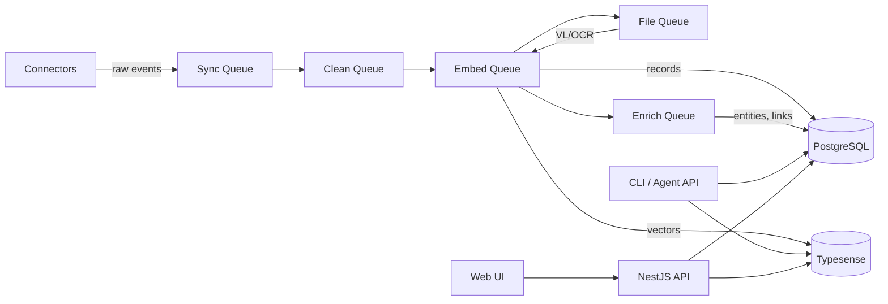

# Botmem

**Personal Memory for AI Agents** — self-hosted, cross-modal, yours.

[](LICENSE)
[](https://github.com/botmem/botmem/actions)
[](https://www.npmjs.com/package/botmem)

Botmem ingests events from your email, messages, photos, and locations — normalizes them into a unified memory schema — and provides cross-modal retrieval with weighted ranking. Your AI agents get a queryable personal memory layer. You keep full ownership of your data.

## Features

- **Semantic + keyword search** — hybrid BM25 + vector retrieval via Typesense
- **7 connectors** — Gmail, Slack, WhatsApp, iMessage, Photos/Immich, Locations/OwnTracks, Telegram
- **Agent API + CLI** — `botmem search`, `botmem ask` for humans and AI agents
- **AES-256-GCM encryption** — credentials and PII encrypted at rest with a recovery key
- **Connector SDK** — build your own connectors with `@botmem/connector-sdk`
- **Automatic contact resolution** — deduplicates people across all data sources
- **Memory graph** — related memories linked by semantic similarity

## Quick Start

### Docker (recommended)

```bash
git clone https://github.com/botmem/botmem.git
cd botmem
cp .env.example .env          # Configure environment (edit as needed)
docker compose pull            # Pull the latest image
docker compose up -d           # Starts everything on http://localhost:12412
```

### Development

Requires Node.js 20+, pnpm 9.15+, and Docker.

```bash
git clone https://github.com/botmem/botmem.git
cd botmem
docker compose up -d postgres redis typesense   # Infrastructure only
pnpm install
cp .env.example .env
pnpm dev                      # API + web on http://localhost:12412
```

### Production

```bash
cp .env.example .env.prod     # Edit with production secrets
docker compose -f docker-compose.prod.yml up -d
```

See the [deployment guide](https://docs.botmem.xyz/guide/deployment) for full production setup.

## Architecture



## Connectors

| Connector     | Auth                   | Data                          |
| ------------- | ---------------------- | ----------------------------- |
| Gmail         | OAuth 2.0              | Emails, contacts, attachments |
| Slack         | OAuth 2.0 / User token | Messages, channels, profiles  |
| WhatsApp      | QR code (Baileys)      | Messages, media, contacts     |
| iMessage      | Local tool             | Messages (macOS only)         |
| Photos/Immich | API key                | Photos, face tags, metadata   |
| OwnTracks     | HTTP auth              | GPS locations, geofences      |
| Telegram      | Bot token              | Messages, media, contacts     |

## CLI

```bash
# Search memories
npx botmem search "meeting with Sarah about Q3 budget"

# Ask a question (RAG)
npx botmem ask "What did John say about the project deadline?"

# JSON output for agents
npx botmem search "travel plans" --json
```

## Monorepo Structure

```
apps/
  api/             NestJS 11 backend (REST + WebSocket)
  web/             React 19 + React Router 7 + Tailwind 4
packages/
  cli/             CLI tool (botmem)
  connector-sdk/   BaseConnector + ConnectorRegistry
  connectors/      Gmail, Slack, WhatsApp, iMessage, Immich, OwnTracks, Telegram
  shared/          Cross-layer types
```

## Stack

**Backend:** NestJS 11, Drizzle ORM, PostgreSQL, BullMQ/Redis, Typesense
**AI:** Ollama (default) or OpenRouter — swappable via `AI_BACKEND` env var
**Frontend:** React 19, Vite 6, Zustand 5, Tailwind 4
**Tooling:** pnpm workspaces, Turborepo, Vitest, Husky

## Documentation

Full docs at [docs.botmem.xyz](https://docs.botmem.xyz):

- [Quick Start](https://docs.botmem.xyz/guide/quickstart)
- [Configuration](https://docs.botmem.xyz/guide/configuration)
- [Agent API & CLI](https://docs.botmem.xyz/agent-api/)
- [Architecture](https://docs.botmem.xyz/architecture/)
- [Building a Connector](https://docs.botmem.xyz/connectors/building-a-connector)

## Contributing

See [CONTRIBUTING.md](CONTRIBUTING.md) for development setup, PR process, and guidelines.

## License

[AGPL-3.0](LICENSE)
